# LLWeChat 1.0
**本README包含18张效果图，约36M大小，载入时间较长，请耐心等待**

##写在前面
1、我是以极认真的态度来做这个项目，我不想把它做成一个只能展示给人看的Demo，经不起实际使用，只能远观不可亵玩， 那样没什么意思。 
2、我不想使用假数据， 所以消息通讯使用环信SDK，保证聊天完全真实。同时对环信SDK进行了彻底封装，做到业务代码和环信完全隔离。 
3、在整个开发过程中，我以媲美微信为目标， 同时参考支付宝、易信、陌陌和钉钉。以万为目标必能过千，这个项目还是有闪光点的。  
4、整个开发过程就我一人，没有什么Word文档，我的产品文档就是赤裸裸的截屏，到现在为止微信截屏将近300张。   你们一定好奇，干吗要截屏这么多，因为微信的细节是做的最到位的，我想这也是微信一家独大的一个成功因素吧 。 
5、我只专注于聊天模块，其他功能一概而过，点到为至。添加好友是项目完整性需要，消息搜索纯粹就是想换换大脑，做点别的。 
6、每一个功能，我会把自己的APP和这五款APP在细节、完成度、bugfree这三个方面作对比，直到我满意为止。我说我的APP不比任何商用的差，不是我站在这张嘴胡咧咧，而是我在一个细节一个细节的对比中、完善中得出的：LLWeChat，不逊于任何人。 
7、这个项目今年07-15开始，原来打算练练手就得了，没想到越做越认真， 做了3个月，国庆后完善了1个月。由于一个人精力实在有限，第一个版本到此结束。 
8、我iOS是阅读开源项目入的门，这个项目躺在硬盘里也没什么用，晾出来希望对大家有所帮助。 

##雕琢细节
要想媲美微信，就必须要雕琢细节，在细节上下功夫，做到位。否则细节上马马虎虎，媲美微信就是一句空话。

###（一）、消息输入
####1、输入面板基本功能 

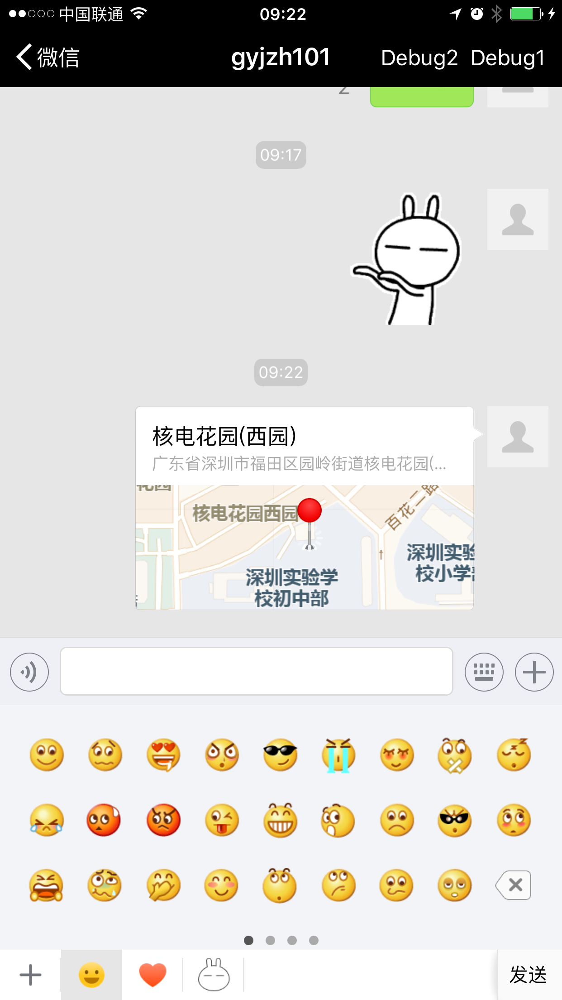 

####2、输入框动态调整高度
* 细节1：当行数增加、减少时，做出动画，而不是一步到位。
* 细节2：除非用户滚动文本，否则文本编辑时不允许出现某一行只漏出一部分。

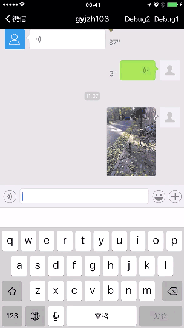

####3、草稿
当一个会话有草稿时，应该在会话push动画开始时就完成如下工作： 读取最新13条消息，解析消息，获取消息缩略图，布局输入框并显示草稿最后一行，弹出键盘（尤其是第三方键盘），布局TableView。 当首次进入会话时，如何高效完成这些工作是一个很大的挑战。我花费了许多力气，但还是不太满意。 

###(二）、GIF
* 细节1：内存大小。把GIF转成imageView，内存会暴涨，不可行。只能播一帧获取一帧图片
* 细节2：重用。GIF快速重用时，因为是后台获取帧图片需要处理好同步，还得记住播放进度，以便重用回来的时候继续播放 

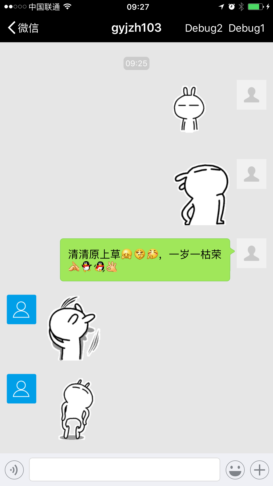 

###（三）、文本
* 细节1：文本中包含的链接有三个行为：点击、长按、高亮。高亮要细心处理，否则效果会很糟糕：滚动文本触及了链接不高亮，点击链接必高亮，高亮后依然允许滚动，触发滚动取消高亮等
* 细节2：文本全屏浏览的触发方式（下面有说明），全屏浏览进入退出时的动画。
* 细节3：AppleSDK识别文本中URL不太精确，需要自己提供正则式，暂未实现。

####1、文本链接

###（四）、地图
* 细节1：地图附近POI搜索，我想根据用户位置、当前时间等做推荐式搜索，暂未实现。
* 细节2：点击地图Cell后要支持侧滑返回，系统默认的NavigationBar交互式返回动画效果不太好，但也可以接受。

####1、地图基本功能

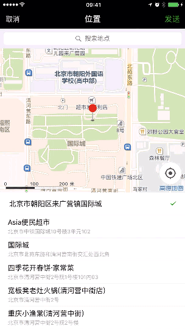

####2、地图搜索

###（五）、ImagePicker
ImagePicker做了PhotoKit和AssetLibrary适配
* 细节1：整个ImagePicker的核心就是决定一张照片获取方式是同步还是异步，照片质量是fullScreen还是fullResolution； AssetLibrary框架要自己决定， 而PhotoKit框架替你做了一部分。
* 细节2：需要考虑照片或视频已经被用户删除的情况，这时选择、全屏浏览、发送要特殊处理下

####1、照片浏览

####2、照片发送

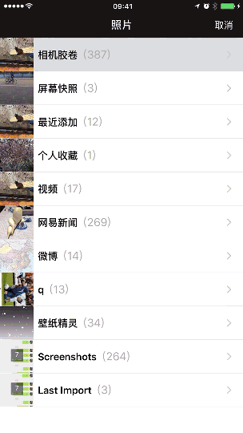

####3、视频发送

###（六）、照片视频浏览
* 细节1：长照片弹出弹入动画，在ImageView做Frame动画的同时，其包含的image也会从当前偏移位置滚动到目标偏移位置。
* 细节2：视频使用AVPlayer播放，而AVPlayer需要占用主线程，使得快速浏览时明显卡顿，我的解决方法就是用视频第一帧图片代替视频滚动，滚动结束时关联AVPlayer和VideoURL，当用户点击播放按钮或拖动进度条时把图片换成真正的视频。
* 细节3：适应屏幕旋转。特别当用户在设备水平朝向时，点击返回。需要先把照片视频旋转到竖立方向，然后再做弹出动画。
* 细节4：照片视频浏览时的bottomBar的切换，照片视频下载状态的更新，这块规则很多很杂，不列举了

####1、照片视频弹入弹出动画

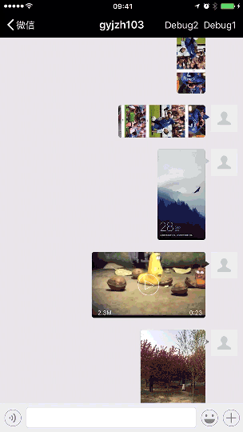

####2、视频下载

###（七）、语音
* 细节1：按压录音按钮小于0.25秒， 弹录音太短Tip，大于则变按钮title为“松开 结束”同时录音开始；小于1.25秒，弹录音太短Tip；大于1.25秒出现录音动画，此时录音时长刚好1秒。51秒时弹倒计时，60秒时强制结束录音并取消录音按钮按压事件。
* 细节2：录音时APP进入后台，则结束并发送录音。再返回APP时，录音按钮第一次点击无效，不清楚原因，暂未解决。
* 细节3：播放录音有：音量太低Tip，播放模式切换，未读声音联播等

####1、语音录制

 

####2、录音最大时长

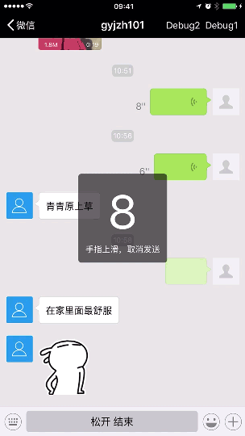

###（八）、缓存
####1、MessageCell缓存
* GIF、日期消息只重用，不缓存
* 整个APP默认缓存MessageCell `1300条`，超出的消息采用TableView重用机制
* 退出当前会话后，保留会话最近MessageCell `130条`
* 自定义数值，可在`LLMessageCellManager`中更改

####2、照片、视频缩略图
* 本项目没有采用环信SDK提供的缩略图，而是APP负责缩略图的创建、存储、删除
* 照片、视频MessageCell不可见时就清空缩略图，可见时再读取缩略图
* 为了加快缩略图读取，内存中默认缓存缩略图上限`80M`
* APP运行时会把一段时间内未读取过的缩略图从硬盘上删除
* 自定义数值可在`LLMessageThumbnailManager`中更改

###（九）、其他
其他界面只实现了最简单的功能

####1、批量删除
* 细节1：弹出的ActionSheet在键盘之上 
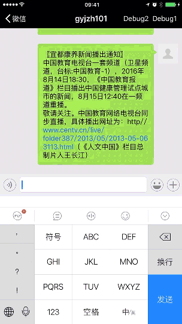

####2、添加好友
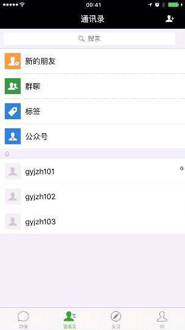 

####3、消息搜索
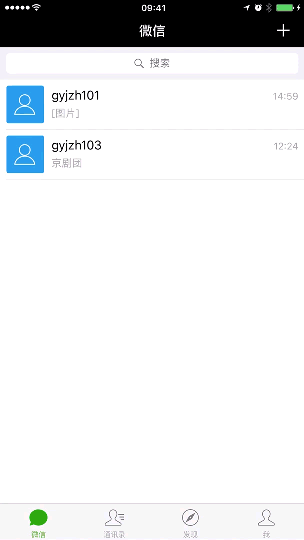

####4、新消息通知
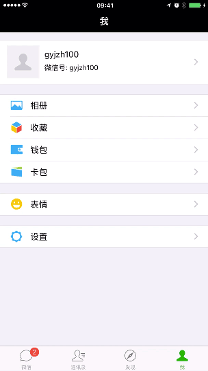

##项目基本信息
* 开发语言：Objective-C
* 最低部署版本：iOS8.0
* 支持iOS版本：iOS8、iOS9、iOS10
* 手机适配：iPhone6 plus最好，iPhone6次之。其他机型没有兼顾到

##第三方库
* 环信SDK（`71M`），已包含在项目中
* 高德SDK（`15.6M`），已包含在项目中
* MBProgressHUD，已包含在项目中
* Github下载项目Zip包大小：`40M`

##项目安装
1、切换到`Podfile`文件所在目录，运行  `pod install` （当前版本Podfile内容为空） 
2、使用高德地图，请到[高德官网注册APP Key](http://lbs.amap.com/console/key)，然后替换掉`LLGDConfig.h`头文件中APPKey即可。 
注册步骤为：注册成为开发者->点击右上角控制台->我的应用->创建新应用  
3、运行`LLWeChat.xcworkspace`   
4、输入账号/密码(未注册时)
5、点击注册即可(自动登录)

##项目目录
|目录 | 说明|
| ---------- | -----------|
| General | 该目录包含和项目耦合性最低的通用模块，包括声音管理器、照片选取器、通用UI、Utilities等 |
| Server | 该目录封装环信SDK，环信SDK一共封装成四个类：  1、LLClientManager：管理用户的注册、登陆、登出等  2、LLChatManager：管理会话消息的收发、本地消息的加载更新等 3、LLContactManager： 管理好友列表 4、LLSDKError：环信SDK错误码的封装|
| Data | 数据目录，包括Config、Cache、Model等 |
| Client | 该目录是项目的主体，按照业务功能分类，分为会话、聊天、搜索、通讯录、设置等|
**Server、Data可以直接访问SDK，Client代码不允许直接访问环信SDK，要把环信SDK和Client完全隔离开**

##产品设计
产品设计上的一些想法，汇总在[产品设计](产品设计.md)

##下个版本
下个版本实现如下功能：  
1、小视频 
2、语音、视频通话 
3、消息搜索、上拉刷新 
4、群聊 
5、通讯录 

##更新日志：2016-11-24
1、删除stable分支，只保留master、develop两个分支，越简单越好。 
2、适配IOS10，原项目在IOS10运行会直接奔溃。 

##Licenses
本项目所有LL-开头的源码遵守MIT license. 
本项目绝大部分资源归腾讯公司所有
